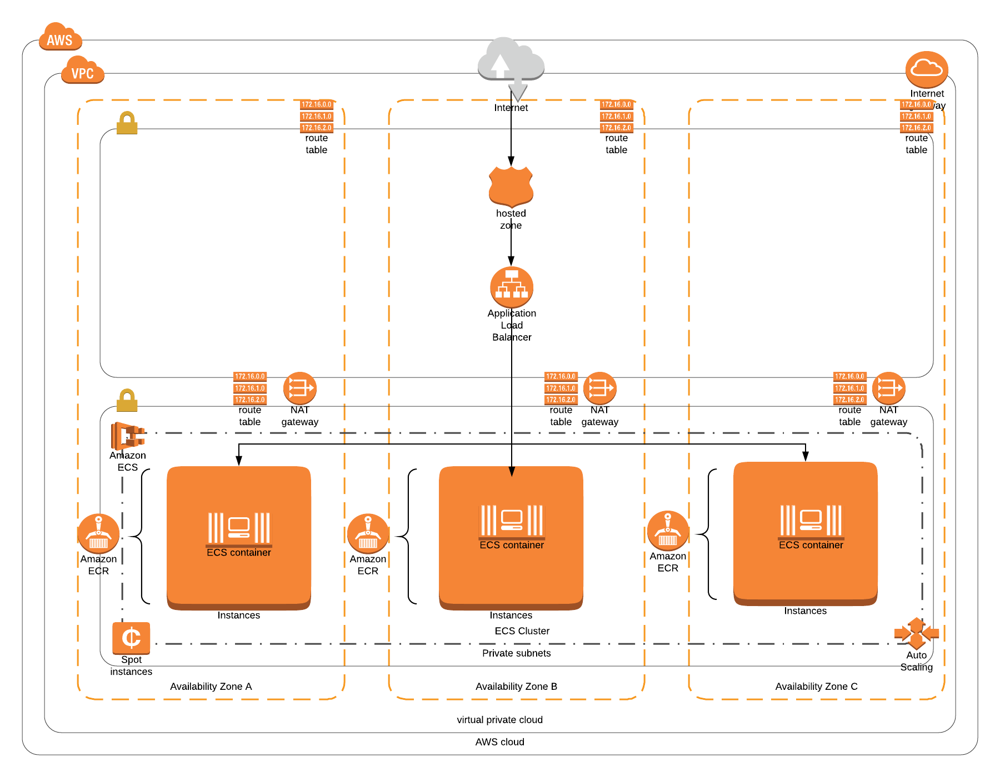

# Services

* [LoadBalancer](#loadbalancer)
* [Discovery](#discovery)
* [Listener Rules](#listener)
* [Services](#services)

## LoadBalancer
A load balancer serves as the single point of contact for clients. The load balancer distributes incoming application traffic across multiple targets, such as EC2 instances, in multiple Availability Zones. This increases the availability of your application. You add one or more listeners to your load balancer.

Each target group routes requests to one or more registered targets, such as EC2 instances, using the protocol and port number that you specify. You can register a target with multiple target groups. You can configure health checks on a per target group basis. Health checks are performed on all targets registered to a target group that is specified in a listener rule for your load balancer.

**This template is invoked from `main.yml` file.**

* **LoadBalancerName**: Resource name.
* **Scheme**: Internal or Internet Facing
* **Certificate**: SSL Certificate.
* **SubnetIds**: Subnets where the LB is able to listen.
* **VpcId**: VPC ID.

## Discovery

Service discovery is the automatic detection of devices and services offered by these devices on a computer network. Service discovery aims to reduce the configuration efforts from users. This is accomplish using route 53.

Amazon Route 53 effectively connects user requests to infrastructure running in AWS – such as Amazon EC2 instances, Elastic Load Balancing load balancers, or Amazon S3 buckets – and can also be used to route users to infrastructure outside of AWS. You can use Amazon Route 53 to configure DNS health checks to route traffic to healthy endpoints or to independently monitor the health of your application and its endpoints. Amazon Route 53 Traffic Flow makes it easy for you to manage traffic globally through a variety of routing types.

Each Application LoadBalancer created, will create a new Route53 Hosted zone. Where all services created using the created LoadBalancer will be added as a record set entry to the created hosted zone. This may be internal or external, depending on the type of LoadBalancer created.

### Hosted zone:
This resurce is created withing the LoadBalancer creation.
* **Domain**: Domain name to be assigned to the Hosted Zone.

### Record Set:
This resource is created withing the service creation.
* **Subdomain**: Subdomain, i.e. my-app.internal.domain. In this case my-app would be the subdmain.
* **PrivateDomain**: User specified domain, internal or external.
* **CanonicalHostedZoneID**: The ID of the Amazon Route 53 hosted zone associated with the load balancer, for example Z2P70J7EXAMPLE.
* **LoadBalancerDomain**: The DNS name for the load balancer, for example my-load-balancer-424835706.us-west-2.elb.amazonaws.com.

## Listener
A listener checks for connection requests from clients, using the protocol and port that you configure, and forwards requests to one or more target groups, based on the rules that you define. Each rule specifies a target group, condition, and priority. When the condition is met, the traffic is forwarded to the target group. You must define a default rule for each listener, and you can add rules that specify different target groups based on the content of the request (also known as content-based routing).

**This template is invoked from `services.yml` file.**

* **CreateHttpListener**: Create HTTP listener or just HTTPS
* **ContainerPort**: Port where serivce is listening.
* **HealthCheckHttpCode**: Health Check HTTP Code (200-499)
* **HealthCheckPath**: Health check path (/)
* **HostPattern**: Subdomain from service (subdomain.company.com)
* **HttpListenerArn**: LoadBalancer listener ARN (HTTP)
* **HttpsListenerArn**: LoadBalancer listener ARN (HTTPS)
* **LoadBalancerName**: LoadBalancer Name.
* **PathPattern**: Path to listen (default: \*)
* **Priority**: Priority on loadbalancer.
* **ServiceName**: Service Name.
* **StackName**: Stack Name, used for resouce naming.
* **TargetGroupArn**: (Optional) in case there is a need of specifying a target group.
* **TargetGroupName**: (Default) TargetGroup resouce name.
* **VpcId**: VPC ID.

## Services
Amazon ECS allows you to run and maintain a specified number of instances of a task definition simultaneously in an Amazon ECS cluster. This is called a service. If any of your tasks should fail or stop for any reason, the Amazon ECS service scheduler launches another instance of your task definition to replace it and maintain the desired count of tasks in the service depending on the scheduling strategy used.

**This template is invoked from `main.yml` file.**

* **Environment**: Development, Staging or Production, used to name resources
* **DesiredCount**: Desired count for container on the service.
* **StackName**: Stack name, used to name resources.
* **QSS3BucketName**: Bucket name holding the templates.
* **QSS3KeyPrefix**: Folder name holding the templates.
* **VpcId**: VPC ID.
* **Cluster**: Cluster Name.
* **ServiceName**: Service Name, *needs to match service template name under service directory*
* **ServiceType**: Public or Private.
* **ContainerPort**: Container port where the service is listening.
* **LoadBalancerArn**: (Public dependent) Specifies the loadbalancer ARN.
* **LoadBalancerHttpListenerArn**: (Public dependent) Listener for HTTP connections.
* **LoadBalancerHttpsListenerArn**: (Public dependent) Listener for HTTPS connections.
* **LoadBalancerName**: (Public dependent) LoadBalancer Name.
* **Subdomain**: (Public dependent) subdomain name (subdomain.company.com).
* **Priority**: (Public dependent) Priority for loadbalancer.

