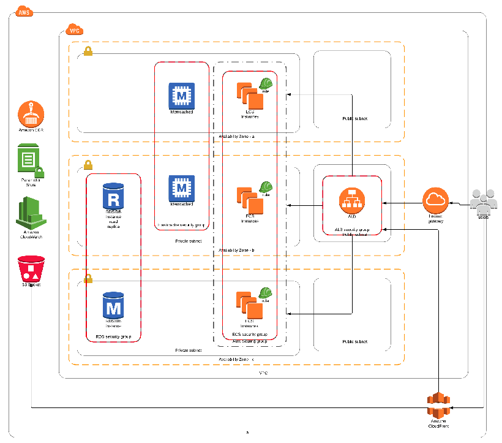

# <client> Terraform Infrastructure

## Repo Layout
* environments - Environments state files with its own variables.
* images - Architecture diagrams
* modules - Infrastructure orchestration and templates

## Getting started
To use this repo first, you should get familiar with [Terraform](https://terraform.io).
This repo is used to deploy the qa, stage and prod environments and to bring up all the private and public services.
## Terraform Structure
The Terraform code is divided into several directories:
* `modules`: These are low level components, they are reused all over the codebase, but shouldn't be called directly from an `environment`.
* `environments`: They are an instance of a stack, and allow us to duplicate our stacks easily. Terraform should only ever be executed from the environment directories, as it will produce `tfstate` files describing these environments in AWS.
## Modules Introduction
* `alb`: It is used to create an internal alb and an external alb in the `stacks` modules.
* `elasticache`: It is the one who creates the Redis cluster.
* `cloudfront`: Creates a cloudfront service for CDN.
* `ecs-autoscaling`: Creates an ECS cluster with autoscaling and cloudwatch alarms attached.
* `ecs-delayjob`: Creates three ECS Services inside ECS cluster without auto scaling nor cloudwatch alarms.
* `ecs-service`: Creates a ECS Service inside ECS cluster with autoscaling and cloudwatch alarms.
* `elasticache`: Creates a elasticache service for Redis.
* `network`: Has the VPC and subnets creation.
* `rds`: It is used to create the postgres databases.
* `ssm`: Creates and encrypts the generated secrets (RDS and Redis endpoints).
## Creating a new environment
Inside the `infrastructure` directory, you'll find all the code to manage a stack.
Most of the time you'll just need to work from the `environments` directory.
You should only use the `terraform` command from one of the `environments` directory. The `modules` directory should only be included into environment stacks.
When creating a new environment, we should always append an id to the end. The only times this isn't the case are for the `core` and `global` environments, which are unique environments in our entire infrastructure. But it's very likely that other environments will be duplicated several times (eg. `store0`, `store1`, ...)
## Terraform variables

### Setting up the enviroment:
| Name | Description | Type |
| ------------- |:-------------:| -----:|
| provider | Specify the region to deploy. | Map |
| enviroment | Specify the enviroment type. | String |
| vpc | Define the vpc settings. | Map |
| private_subnets | Define all three private settings. | Map |
| public_subnets | Define all three public settings. | Map |
| az_count | Specify the number of availability zones. | String |
| alb_certificate_arn | ARN of the alb certificate. | String |
| desired_capacity | Desired capacity of the EC2 instances register to the cluster of ECS. | String |
| ecs_max_size | Maximum number of EC2 instances register to the cluster of ECS. | String |
| ecs_min_size | Minimum number of EC2 instances register to the cluster of ECS. | String |
| key_name | KeyPair name for EC2 instances register to the cluster. | String |
| instance_type | Instance family type for EC2 instance register to the cluster. | String |
| database | Database settings for RDS instance. | Map |
| service_name | Service name defined for ECS Service. | String |
| backfill_service_name | Service name defined for ECS Service. | String |
| serial_service_name | Service name defined for ECS Service. | String |
| rails_ecr | ECR Repository of Docker images for Rails. | String |
| rails_tag | Tag that identify the docker image. | String |
| rails_cpu | CPU allocation for task definition. | String |
| rails_mem | RAM MEM allocation for task definition. | String |
| nginx_ecr | ECR Repository of Docker images for nGinx. | String |
| nginx_tag | Tag that identify the docker image. | String |
| nginx_cpu | CPU allocation for task definition. | String |
| nginx_mem | RAM MEM allocation for task definition. | String |
| containerPort | Container port exposed from the container. | String |
| task_count | Number of task running in the service | String |
| cpu_up_eval_periods | Number of periods of evaluation to trigger the CloudWatch alarm as Alarm. | String |
| cpu_up_period | Number of seconds between evaluation of the metric of CloudWatch. | String |
| cpu_up_threshold | Threshold number to change state of alarm. | String |
| mem_up_eval_periods | Number of periods of evaluation to trigger the CloudWatch alarm as Alarm. | String |
| mem_up_period | Number of seconds between evaluation of the metric of CloudWatch. | String |
| mem_up_threshold | Threshold number to change state of alarm. | String |
| cpu_down_eval_periods | Number of periods of evaluation to trigger the CloudWatch alarm as Alarm. | String |
| cpu_down_period | Number of seconds between evaluation of the metric of CloudWatch. | String |
| cpu_down_threshold | Threshold number to change state of alarm. | String |
| mem_down_eval_periods | Number of periods of evaluation to trigger the CloudWatch alarm as Alarm. | String |
| mem_down_period | Number of seconds between evaluation of the metric of CloudWatch. | String |
| mem_down_threshold | Threshold number to change state of alarm. | String |
| delayed_cpu | CPU allocation for task definition. | String |
| delayed_mem | RAM MEM allocation for task definition. | String |
| elasticache_engine_version | Redis version to start a cluster of Elasticache. | String |
| parameter_group_name | Parameters of the redis cluster. | String |
| elasticache_instance_type | Instance type of elasticache cluster. | String |
| maintenance_window | Maintenance windows to upgrade elasticache cluster. | String |

# OpenVPN
